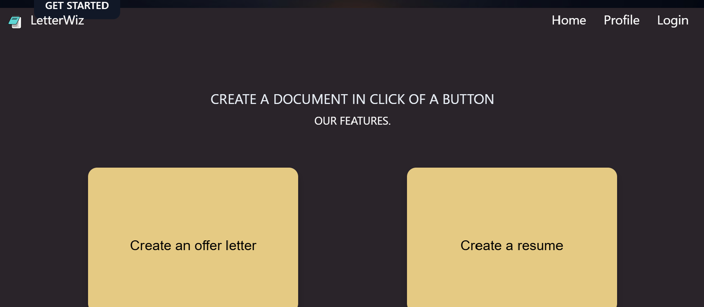
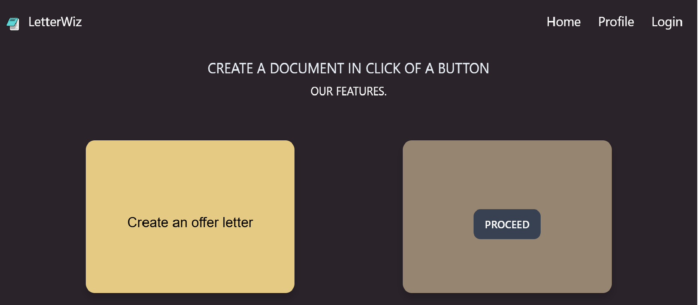
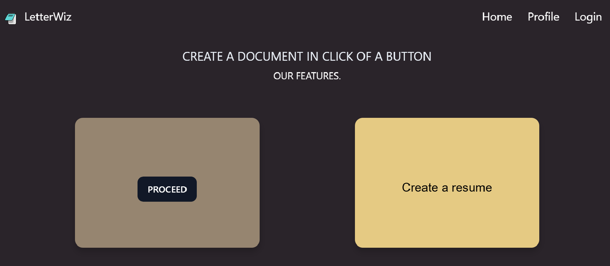

# CareerDoc - Offer Letter and Resume Generator

## Project Overview
CareerDoc is a comprehensive offer letter and resume generator built using the MERN (MongoDB, Express.js, React.js, Node.js) stack. 
The application integrates Google OAuth for secure login authentication, ensuring a seamless and efficient user experience. 
CareerDoc streamlines the process of creating professional documents, making it a valuable tool for job seekers and HR professionals.

## Features

- **Resume Generation**: Users can create professional resumes quickly.
- **Offer Letter Creation**: HR teams can generate tailored offer letters.
- **Secure Login**: Integrated Google OAuth 2.0 for user authentication.
- **User-Friendly Interface**: Simple and intuitive UI for ease of use.
- **Real-Time Data**: Data storage and retrieval with MongoDB for real-time updates.

## Screenshots
### Homepage


 
Select any of the options (Resume/Offer letter)





### Login Page
- Without login, no one can generate any of the letters.


  ## Tech Stack

- **Frontend**: React.js
- **Backend**: Node.js, Express.js
- **Database**: MongoDB
- ** User Authentication**: Google OAuth 2.0


## Installation

1. Clone the repository:
   ```bash
   git clone https://github.com/vaibhavsdewan/CareerDoc-Offer-Letter-and-Resume-Generator.git

2. Navigate to the project directory.
  
3. Install dependencies for both frontend and backend:
cd backend
npm install
cd frontend
npm install

4. Set up environment variables.

5. Start the development server.

6. Open the app in your browser.


## Usage

1. Navigate to the homepage.
2. Sign in using your Google account.
3. Create or upload your resume data.
4. Generate offer letters with customizable templates.
5. Download and share documents in PDF format.


## Contributing

Contributions are welcome! Please follow these steps:

1. Fork the repository.
2. Create a new branch (git checkout -b feature-name).
3. Commit your changes (git commit -m "Add feature name").
4. Push to the branch (git push origin feature-name).
5. Open a pull request.


